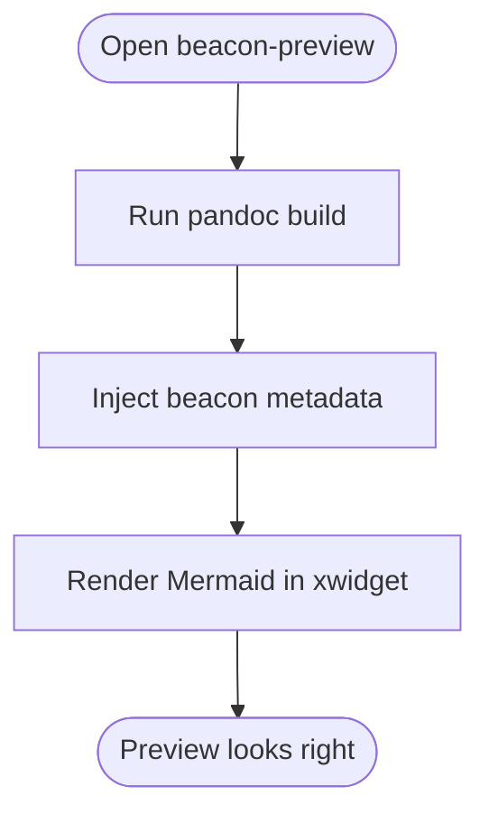

# Mermaid Preview Sample

This file is a compact manual check for optional preview styling and Mermaid runtime support.

## Checklist

- [x] GitHub-style CSS is applied
- [x] Wrapper-scoped typography looks reasonable
- [ ] Mermaid diagram renders below

## Mermaid



## Code Block

```elisp
(message "beacon-preview mermaid sample")
```

## Quote

> Blockquotes should still look clean and remain beacon targets.

## Table

| Item     | Expected Result |
|----------|-----------------|
| CSS      | Styled content  |
| Mermaid  | Rendered graph  |
| Beacons  | Navigation works |

